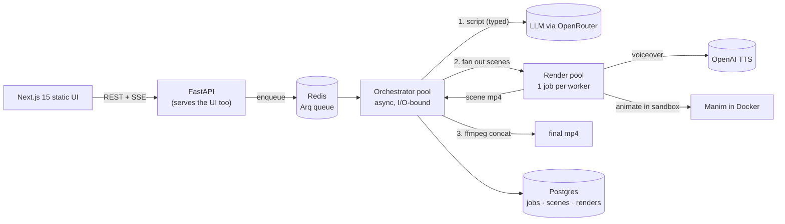

<h1 align="center">🎬 algo-reel</h1>

<p align="center">
  <b>An open-source text-to-video generator: turn a prompt into a short, narrated explainer or tutorial video, scripted, voiced, and animated by an LLM.</b>
</p>

<p align="center">
  Type <code>explain merge sort</code>. algo-reel writes the script, voices each scene with TTS,
  animates it with <a href="https://www.manim.community/">Manim</a> (the engine behind 3Blue1Brown),
  and stitches the scenes into an MP4.
</p>

<p align="center">
  
  
  
  
  
  
  
</p>

---

## What it is

algo-reel is an open-source **text-to-video generator for explainer and tutorial content**. A prompt goes in; a narrated MP4 comes out, usually under three minutes. The LLM plans a scene-by-scene script as typed data (not free text you have to parse), generates real Manim code for each scene, and a worker pool renders and concatenates them.

The renderer sits behind one interface, so the Manim (code-driven, 3Blue1Brown style) path you get today can be swapped for an AI-image path (Flux stills with Ken Burns motion) without changing the rest of the pipeline.

## Why I built it

I wanted explainer videos in the 3Blue1Brown style without authoring Manim by hand for every animation. Manim is excellent, but writing it scene by scene is slow, and that friction is exactly the kind of thing an LLM should absorb.

The catch is that asking a model for "a video" naively falls apart fast. The generated code doesn't compile. Narration drifts out of sync with the animation. One bad scene takes down a ten-minute render. Costs creep up with every retry. So the interesting part was never the prompt. It was the machinery around it: a job queue that treats a video as a DAG of scenes, a sandbox that runs model-written Python without trusting it, a retry loop that hands compiler errors back to the model, and a budget cap so a runaway script can't quietly burn money.

I built it because I wanted the videos, and because it was a good excuse to do real distributed-systems work on top of an LLM instead of shipping another thin wrapper around a chat endpoint.

## Features

1. **Prompt to narrated MP4, end to end.** Script generation, per-scene voiceover, animation, and final concat run as a single pipeline. You give a topic and a target length; you get a finished video.
2. **Code-driven animation with Manim.** Every scene is real Manim Community Edition Python rendered to video, the same engine 3Blue1Brown uses, so the output is precise mathematical animation rather than stock footage.
3. **Pluggable renderer interface.** Manim and AI-image both implement one `SceneRenderer` protocol and return scene MP4s. Composition stays renderer-agnostic, so adding a style does not touch the orchestrator.
4. **Untrusted code runs locked down.** Model-generated Python renders inside a Docker container with a read-only filesystem, no network, a tmpfs scratch dir, a non-root UID, and memory, CPU, and PID caps. Generated code never touches the host.
5. **Two-tier worker model.** An async orchestrator pool (I/O-bound, holds many jobs at once) is split from a CPU-bound render pool (one job per worker). They scale independently, so a heavy render never blocks the API or the orchestration loop.
6. **Self-healing render loop.** When a scene's Manim fails, the worker captures stderr and feeds the failing code plus the error back to the model for up to three attempts, escalating from a cheaper model to a stronger one rather than re-running the one that just failed.
7. **Tiered, swappable LLM strategy.** Planning, code generation, retries, and validation each use a model picked for that job (Sonnet, Opus, and Haiku by default). Every stage is set by an environment variable, so you can repoint the whole pipeline at any OpenRouter model.
8. **Resumable jobs.** Postgres is the source of truth. If the orchestrator crashes or a single scene fails, work continues from the first incomplete step. A `partially_failed` job re-renders only the broken scenes via `POST /api/videos/{id}/resume`, not the whole video.
9. **Cost circuit breaker.** The orchestrator estimates spend from the script before fanning out and fails fast if it would exceed the per-job budget. Cost is tracked per stage in the database for alerting.
10. **Live progress over SSE.** A Next.js 15 static frontend, served by FastAPI itself, streams per-scene updates like "rendering scene 3 of 6, retry 1" over Server-Sent Events instead of polling.

One design choice worth calling out: audio is generated first. TTS runs per scene to get the exact spoken duration, then the renderer is constrained to fit it, which removes sync drift between narration and animation.

## Architecture



A video is modeled as a DAG of independent scenes, not one monolithic task, which is what makes per-scene parallel rendering, retries, and resume possible.

## Tech stack

- **API and orchestration:** FastAPI, Arq (Redis-backed job queue), SQLAlchemy 2 (async) with asyncpg, Alembic, structlog.
- **LLM layer:** Pydantic AI for typed, structured output. Models served through OpenRouter (any OpenAI-compatible gateway works).
- **Voice:** OpenAI TTS, with per-video voice and delivery instructions.
- **Rendering:** Manim Community Edition inside Docker, FFmpeg for concat.
- **Data:** PostgreSQL for state and audit trail, Redis for the queue and SSE pub/sub.
- **Frontend:** Next.js 15 (static export, client-side rendered), React 19, TanStack Query, Tailwind v4, shadcn/ui, served as a static bundle by FastAPI.

## Run it locally

### Prerequisites

- Python 3.12 and [uv](https://docs.astral.sh/uv/)
- Docker (for Postgres, Redis, and the sandboxed renderer)
- Node 18+ (only if you want to build the frontend)
- An [OpenRouter](https://openrouter.ai/) API key (LLM) and an [OpenAI](https://platform.openai.com/) API key (TTS)

### Setup

```bash
git clone https://github.com/subhajit-dutt/algo-reel.git
cd algo-reel

cp .env.example .env
# edit .env: set OPENROUTER_API_KEY, OPENAI_API_KEY, and a strong APP_SHARED_SECRET

make install            # uv sync
make up                 # start Postgres + Redis (docker compose)
make migrate            # apply database migrations
make render-image-manim # build the Manim render image (required for renderer=manim)
```

### Run the three processes

The API, the orchestrator, and the render pool run as separate processes. Open three terminals:

```bash
make dev            # 1) FastAPI API on http://localhost:8000
make worker         # 2) orchestrator pool (script gen, fan-out, concat)
make render-worker  # 3) render pool (TTS + sandboxed Manim render)
```

Create a video:

```bash
curl -s -X POST http://localhost:8000/api/videos \
  -H "Authorization: Bearer $APP_SHARED_SECRET" \
  -H "content-type: application/json" \
  -d '{"prompt":"explain merge sort","renderer":"manim","duration_target":60,"voice":"coral"}'
```

Then stream progress with `GET /api/videos/{id}/events` or open the UI.

### Frontend (optional)

```bash
make frontend-install
make frontend-build   # outputs a static bundle that FastAPI serves at /
```

### Tests

```bash
make test          # unit + integration (Docker required for testcontainers)
make smoke-manim   # full Manim render through the hardened sandbox
make smoke-llm     # live LLM call (costs a few cents)
```

## Configuration and customization

Everything is driven by environment variables in `.env`. The values below are the `.env.example` starters, which run locally as-is. These are the knobs people reach for first.

### Swap the LLM

Each stage is independent, so you can mix models or move the whole thing to a different provider. Any model OpenRouter exposes works, and `LLM_BASE_URL` lets you point at a different OpenAI-compatible gateway.

| Variable | Default | What it controls |
|---|---|---|
| `LLM_SCRIPT_MODEL` | `anthropic/claude-haiku-4.5` | Pass 1: script and scene plan |
| `LLM_CODEGEN_MODEL` | `anthropic/claude-sonnet-4.6` | Pass 2: Manim code per scene |
| `LLM_CODEGEN_RETRY_MODEL` | `anthropic/claude-opus-4.8` | Escalated model on retry |
| `LLM_CRITIC_MODEL` | `anthropic/claude-haiku-4.5` | Pre-render validation |
| `LLM_BASE_URL` | `https://openrouter.ai/api/v1` | LLM gateway endpoint |

### Tune voice, cost, and render output

| Variable | Default | What it controls |
|---|---|---|
| `TTS_MODEL` | `gpt-4o-mini-tts` | Text-to-speech model |
| `TTS_VOICE_DEFAULT` | `coral` | Default narration voice |
| `TTS_INSTRUCTIONS` | calm tutorial voice | Per-video delivery style |
| `MAX_SCRIPT_COST_USD` | `0.50` | Budget cap for script generation |
| `MAX_RENDER_COST_USD` | `1.50` | Budget cap for the render stage |
| `MAX_SCENES_PER_VIDEO` | `12` | Hard cap on scenes |
| `RENDER_VIDEO_SIZE` / `RENDER_VIDEO_FPS` | `1280x720` / `30` | Output resolution and frame rate |
| `MANIM_MAX_ATTEMPTS` | `3` | Content-retry attempts per scene |
| `RENDER_MEMORY` / `RENDER_CPUS` / `RENDER_PIDS_LIMIT` | `2g` / `1.0` / `256` | Sandbox resource limits |

See `.env.example` for the full list.

## Status and roadmap

The Manim path is built and working: prompt in, narrated MP4 out. On the list next:

- **AI-image renderer** (Flux stills + Ken Burns) behind the existing `SceneRenderer` interface.
- **Object storage** (Cloudflare R2 / S3) to replace local disk for scene and final outputs.
- **Script preview and editing** before a render kicks off.

Auth is a single shared bearer token, which fits the small internal audience this was built for. Larger or multi-tenant use would want proper accounts.

## Contributing

Issues and PRs are welcome. Run `make fmt`, `make lint`, and `make typecheck` before opening a PR; tests run with `make test`.
